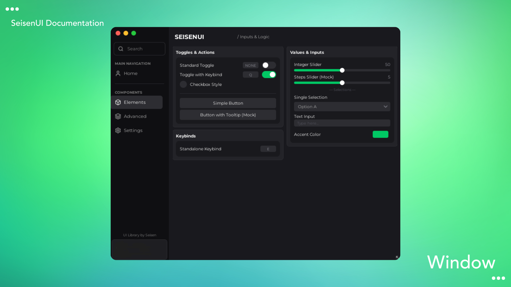

# SeisenUI

<p align="center">
  <strong>A modern, feature-rich UI library for Roblox</strong>
</p>

<p align="center">
  
</p>

> [!WARNING]
> SeisenUI is currently in active development. While stable, new features and improvements are being added regularly. Please report any issues you encounter.

## ✨ Features

- 🎨 **Modern Dark Theme** - Sleek, professional dark interface with customizable accent colors
- 🎯 **Lucide Icons** - Beautiful, consistent iconography with 1000+ icons
- 🧩 **Rich Components** - Toggles, sliders, dropdowns, buttons, color pickers, and more
- 🎭 **Theme System** - Live theme updates with built-in theme manager
- 💾 **Save Manager** - Persistent settings across sessions
- ✨ **Smooth Animations** - Polished transitions using TweenService
- ⌨️ **Keybind Support** - Customizable keybinds for toggles
- 💡 **Tooltips** - Helpful hover tooltips for better UX
- 📱 **Responsive Design** - Scales beautifully across different screen sizes

## 📦 Installation

### Basic Installation

```lua
local Library = loadstring(game:HttpGet("https://raw.githubusercontent.com/Seisen88/Seisen-Library/main/SeisenUI.lua"))()
```

### Quick Start Example

```lua
local Library = loadstring(game:HttpGet("https://raw.githubusercontent.com/Seisen88/Seisen-Library/main/SeisenUI.lua"))()

-- Create a window
local Window = Library:CreateWindow({
    Title = "My Script",
    SubTitle = "v1.0.0",
    Size = UDim2.fromOffset(580, 460),
    Icon = "home" -- Lucide icon name
})

-- Add a tab
local Tab = Window:AddTab({
    Name = "Main",
    Icon = "settings"
})

-- Add a toggle
Tab:AddToggle({
    Name = "Auto Farm",
    Default = false,
    Callback = function(value)
        print("Auto Farm:", value)
    end
})

-- Add a slider
Tab:AddSlider({
    Name = "Walk Speed",
    Min = 16,
    Max = 100,
    Default = 16,
    Increment = 1,
    Callback = function(value)
        game.Players.LocalPlayer.Character.Humanoid.WalkSpeed = value
    end
})
```

## 📚 Full Template

For a complete feature showcase and all available components, check out:

**[Template.lua](https://github.com/Seisen88/Seisen-Library/blob/main/tests/Template.lua)** - Full feature showcase with all components

## � Documentation

For detailed documentation, API reference, and advanced usage:

**[SeisenUI Documentation](https://seisenui.onrender.com/)**

## 🙏 Credits

- [Lucide Icons](https://github.com/lucide-icons/lucide) - Beautiful & consistent icon toolkit

## 📝 License

This project is licensed under the MIT License - see the [LICENSE](LICENSE) file for details.

## 🔗 Links

- [GitHub Repository](https://github.com/Seisen88/Seisen-Library)
- [Documentation](https://seisenui.onrender.com/)
- [Changelog](CHANGELOG.md)
- [Report Issues](https://github.com/Seisen88/Seisen-Library/issues)

---

<p align="center">
  Made with ❤️ by Seisen88
</p>
